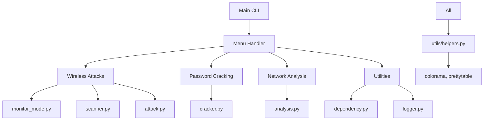

# WiFiSniper Architecture and Feature Plan

## Overview
WiFiSniper is a modular, menu-driven Python-based Wi-Fi pentesting toolkit designed for Kali Linux environments. It automates common Wi-Fi security tasks using libraries like Scapy, Aircrack-ng (via subprocess), and Wireshark (via pyshark). The tool emphasizes user-friendly interfaces with colored output (Colorama) and formatted tables (PrettyTable). It targets ethical hackers and security professionals for network analysis and penetration testing.

The system will be built with a modular architecture:
- **Core**: CLI, logging, dependencies, ASCII art
- **Modules**: Specific functionalities (monitor mode, scanning, attacks, etc.)
- **Utils**: Helpers for formatting, validation, etc.

## Key Features and Menu Structure

### Categorized Main Menu
The main menu will be categorized for better organization. Each category leads to a submenu with specific options. All selections are number-based for ease of use.

#### 1. Wireless Attacks
   - 1.1 Enable Monitor Mode
     - Scan for compatible Wi-Fi adapters
     - Enable monitor mode on selected adapter (e.g., using `airmon-ng start wlan0`)
     - Display status with colored feedback
     - Option to disable monitor mode later
   - 1.2 Scan Wi-Fi Networks
     - Ensure monitor mode is active
     - Perform scan using `airodump-ng`
     - Display results in a PrettyTable: BSSID, ESSID, Channel, Encryption, Signal, etc.
     - Allow continuous scanning or one-time scan
   - 1.3 Deauthenticate Users (Standalone)
     - Prompt for target BSSID or scan first
     - Scan for clients on the network (if not provided)
     - Choose: Single client, All clients, or Custom selection
     - Specify number of deauth packets (e.g., 10, 100, infinite, or continuous)
     - Option for delay between packets
     - Execute `aireplay-ng --deauth` with parameters
     - Colored progress and success messages
     - Ability to stop attack manually
   - 1.4 Handshake Capture
     - Target a WPA/WPA2 network
     - Capture 4-way handshake using `airodump-ng` and `aireplay-ng`
     - Save to file for later cracking
     - Option to combine with deauth for faster capture
   - 1.5 Evil Twin Attack
     - Create fake AP with same ESSID
     - Use hostapd and dnsmasq for setup
     - Capture credentials from connecting clients
   - 1.6 WPS Attacks
     - Scan for WPS-enabled networks
     - Attempt PIN cracking using Reaver or Pixie Dust
     - Brute force or dictionary attacks
   - 1.7 Beacon Flood
     - Flood area with fake beacon frames
     - Create multiple fake SSIDs
     - Use for testing or disruption
   - 1.8 Bluetooth Attacks
     - Scan for Bluetooth devices
     - BlueBorne vulnerability scanning
     - Basic pairing attacks or sniffing

#### 2. Password Cracking
   - 2.1 Crack WPA Handshake
     - Load captured handshake file
     - Choose wordlist or dictionary attack
     - Use `aircrack-ng` or Hashcat integration
     - Display progress and results with colors
   - 2.2 Generate Passwords
     - Custom password generation based on patterns (e.g., length, characters)
     - Integrate with existing password_generator module

#### 3. Network Analysis
   - 3.1 Packet Capture
     - Start Wireshark-like capture using Scapy or pyshark
     - Filter by BSSID, channel, protocol, etc.
     - Save to PCAP file
     - Real-time display of packets
   - 3.2 Client Analysis
     - Analyze connected clients on a network
     - Display MAC addresses, signal strength, device info, etc., in tables
     - Track client activity over time
   - 3.3 Port Scanning
     - Scan for open ports on discovered IPs using nmap
     - Options: Full scan (1-65535), Common ports, Custom range
     - Choose scan type: TCP SYN, UDP, Aggressive, Stealth
     - Display results with service detection
   - 3.4 Wi-Fi Signal Analysis
     - Monitor signal strength over time
     - Graph signal levels (if matplotlib available)
     - Detect interference sources
   - 3.5 Traffic Analysis
     - Analyze captured packets for protocols, data volumes
     - Identify potential vulnerabilities or anomalies
   - 3.6 Vulnerability Scanning
     - Basic Wi-Fi vulnerability checks (weak encryption, WPS enabled)
     - Integration with tools like OpenVAS or custom scripts
     - Generate vulnerability reports

#### 4. Utilities
   - 4.1 Check Dependencies
     - Verify installation of aircrack-ng, scapy, colorama, prettytable, nmap, etc.
     - Install missing ones if possible (using apt/pip)
     - Check for root privileges
   - 4.2 Adapter Management
     - List available adapters with details
     - Switch modes (managed/monitor)
     - Kill interfering processes
   - 4.3 Logs and Reports
     - View session logs with filtering
     - Export results to CSV/JSON/PDF
     - Generate summary reports
   - 4.4 Configuration
     - Set default adapter
     - Configure scan parameters
     - Save/load settings
   - 4.5 Help and About
     - Display help for each module
     - Version info and credits

#### 5. Exit
   - Clean up (disable monitor mode, close processes)
   - Farewell message

### Sample Main Menu Display
Using Colorama for colors and PrettyTable for formatting.

```
WiFiSniper v1.0 - Modular Wi-Fi Pentesting Toolkit
==================================================

[1] Wireless Attacks
[2] Password Cracking
[3] Network Analysis
[4] Utilities
[5] Exit

Select an option (1-5): 
```

### Sample Submenu (Wireless Attacks)
```
Wireless Attacks Menu
======================

[1] Enable Monitor Mode
[2] Scan Wi-Fi Networks
[3] Deauthenticate Users (Standalone)
[4] Handshake Capture
[5] Evil Twin Attack
[6] WPS Attacks
[7] Beacon Flood
[0] Back to Main Menu

Select an option (0-7):
```

### Sample Output with Colorama and PrettyTable

#### Colored Messages (using Colorama)
```python
from colorama import Fore, Style

print(Fore.GREEN + "[SUCCESS]" + Style.RESET_ALL + " Monitor mode enabled on wlan0mon")
print(Fore.RED + "[ERROR]" + Style.RESET_ALL + " Failed to enable monitor mode. Check adapter compatibility.")
print(Fore.YELLOW + "[INFO]" + Style.RESET_ALL + " Scanning for networks... Please wait.")
```

#### PrettyTable Example (Network Scan Results)
```python
from prettytable import PrettyTable

table = PrettyTable()
table.field_names = ["#", "BSSID", "ESSID", "Channel", "Encryption", "Signal"]
table.add_row(["1", "00:11:22:33:44:55", "MyNetwork", "6", "WPA2", "-45"])
table.add_row(["2", "AA:BB:CC:DD:EE:FF", "GuestWiFi", "11", "WEP", "-60"])
print(table)
```

Output:
```
+----+--------------------+------------+---------+------------+--------+
| #  |       BSSID        |   ESSID    | Channel | Encryption | Signal |
+----+--------------------+------------+---------+------------+--------+
| 1  | 00:11:22:33:44:55  | MyNetwork  |    6    |    WPA2    |  -45   |
| 2  | AA:BB:CC:DD:EE:FF  | GuestWiFi  |   11    |    WEP     |  -60   |
+----+--------------------+------------+---------+------------+--------+
```

## Additional Considerations
- **Error Handling**: Robust checks for root privileges, adapter availability, and command failures.
- **Modularity**: Each feature in separate modules for easy extension.
- **Security**: Emphasize ethical use; include disclaimers.
- **Dependencies**: Require Python 3.x, aircrack-ng suite, scapy, pyshark, colorama, prettytable, nmap, hostapd, dnsmasq, reaver.
- **Extensibility**: Allow plugins or additional modules in the future.
- **User Input Validation**: Always prompt for required parameters (e.g., number of packets, target BSSID) with defaults and validation.
- **Continuous Operations**: Support for ongoing attacks/scans with manual stop options (Ctrl+C handling).
- **Logging**: Comprehensive logging for all actions, successes, and errors.

## Detailed Module Interfaces and Dependencies

### Core Modules
- **cli.py**: Main entry point, menu handling, user input validation
- **logger.py**: Colored logging with levels (INFO, SUCCESS, WARNING, ERROR)
- **dependency.py**: Check and install required tools/libs
- **ascii_art.py**: Banner display

### Feature Modules
- **monitor_mode.py**: Enable/disable monitor mode, adapter scanning
  - Functions: `scan_adapters()`, `enable_monitor(interface)`, `disable_monitor(interface)`
- **scanner.py**: Network scanning with airodump-ng
  - Functions: `scan_networks(interface, duration)`, `parse_airodump_output(output)`
- **attack.py**: Deauth, handshake capture, evil twin, WPS, beacon flood
  - Functions: `deauth_attack(bssid, client_mac, count, delay)`, `capture_handshake(bssid, channel)`, etc.
- **cracker.py**: Password cracking with aircrack-ng/hashcat
  - Functions: `crack_wpa(handshake_file, wordlist)`, `generate_passwords(pattern, length)`
- **analysis.py**: Packet capture, client analysis, port scanning
  - Functions: `capture_packets(interface, filter, duration)`, `port_scan(target_ip, ports, scan_type)`

### Utils
- **helpers.py**: Input validation, table formatting, subprocess wrappers
  - Functions: `validate_mac(mac)`, `run_command(cmd)`, `display_table(data)`

### Dependencies
- **Python Libraries**: colorama, prettytable, scapy, pyshark, matplotlib (optional)
- **System Tools**: aircrack-ng, nmap, hostapd, dnsmasq, reaver, wireshark (optional)

## Proposed Architecture Diagram


## High-Level Implementation Plan

### Phase 1: Core Infrastructure
1. Enhance core/cli.py for menu navigation and input handling
2. Implement logger.py with Colorama integration
3. Create dependency.py for checks and installations
4. Build utils/helpers.py with validation and formatting functions

### Phase 2: Basic Wireless Features
1. Implement monitor_mode.py (enable/disable monitor mode)
2. Develop scanner.py (network scanning with PrettyTable output)
3. Add basic attack.py (deauthentication with parameter prompts)

### Phase 3: Advanced Features
1. Extend attack.py (handshake capture, evil twin, WPS, beacon flood)
2. Implement cracker.py (password cracking and generation)
3. Build analysis.py (packet capture, port scanning, signal analysis)

### Phase 4: Utilities and Polish
1. Complete utilities menu (logs, reports, configuration)
2. Add error handling, logging, and user input validation throughout
3. Test integration and refine UI/UX

### Code Structure Overview
```
wifisniper/
├── __init__.py
├── main.py (entry point)
├── core/
│   ├── cli.py (menu system)
│   ├── logger.py
│   ├── dependency.py
│   └── ascii_art.py
├── modules/
│   ├── monitor_mode.py
│   ├── scanner.py
│   ├── attack.py
│   ├── cracker.py
│   └── analysis.py
└── utils/
    └── helpers.py
```

This expanded plan now includes standalone deauth attacks, more wireless features (Evil Twin, WPS, Beacon Flood), enhanced network analysis with nmap integration, and detailed module interfaces. We can expand further with Bluetooth integration or other tools later.